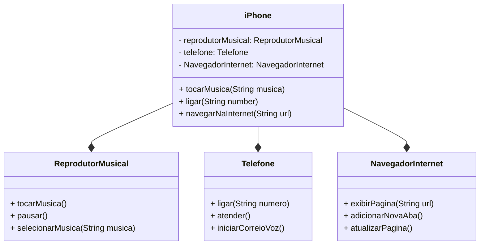

### Diagrama UML (Mermaid) de um Componente iPhone

```mermaid
classDiagram
class iPhone {
    - reprodutorMusical: ReprodutorMusical
    - telefone: Telefone
    - NavegadorInternet: NavegadorInternet

        + tocarMusica(String musica)
        + ligar(String number)
        + navegarNaInternet(String url)
    }

    class ReprodutorMusical {
        + tocarMusica()
        + pausar()
        + selecionarMusica(String musica)
    }

    class Telefone {
        + ligar(String numero)
        + atender()
        + iniciarCorreioVoz()
    }

    class NavegadorInternet {
        + exibirPagina(String url)
        + adicionarNovaAba()
        + atualizarPagina()
    }

    iPhone --* ReprodutorMusical
    iPhone --* Telefone
    iPhone --* NavegadorInternet
```
